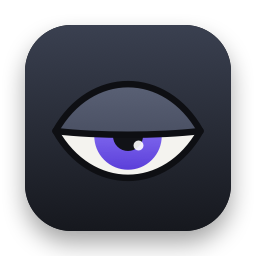
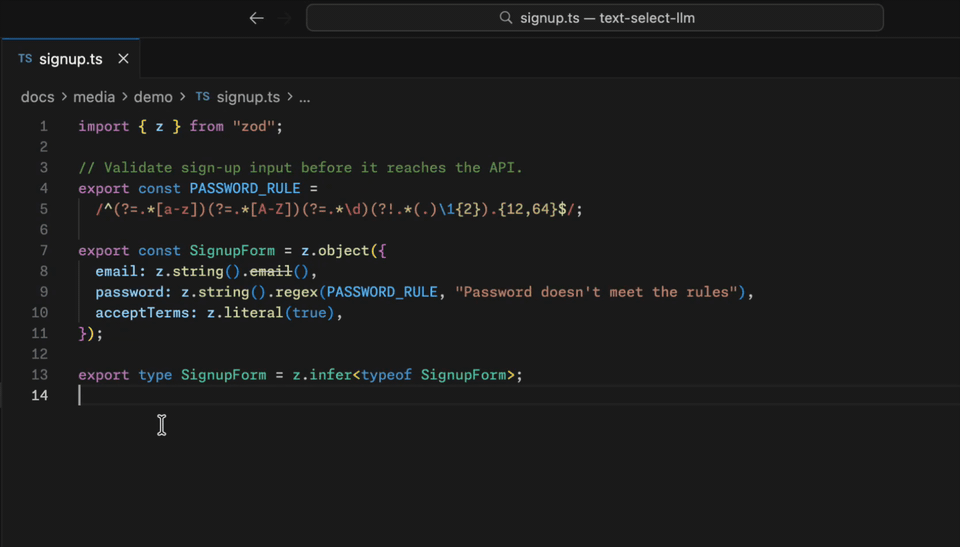
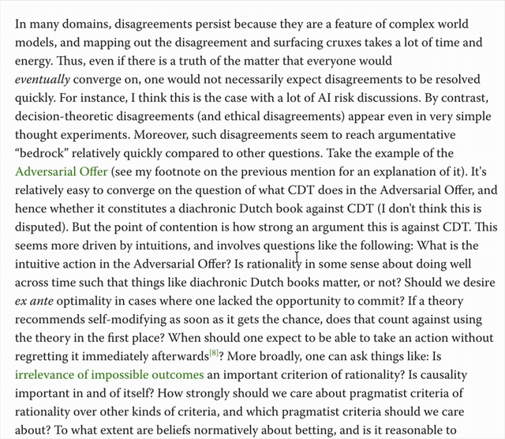
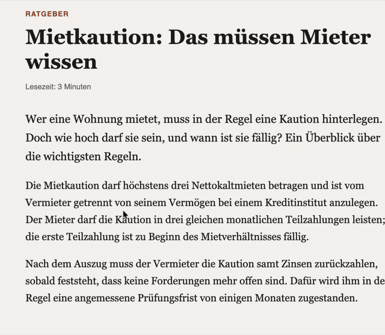
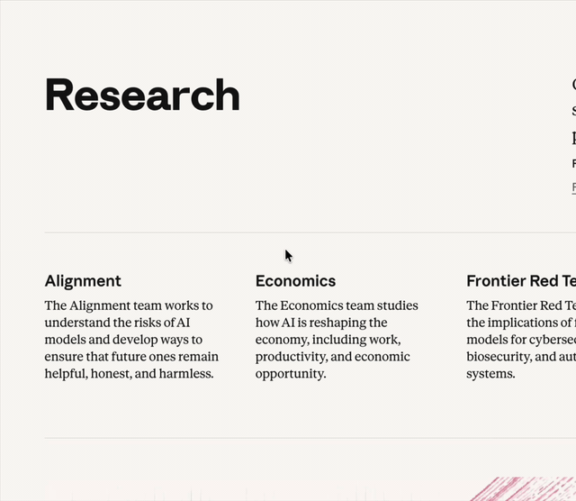
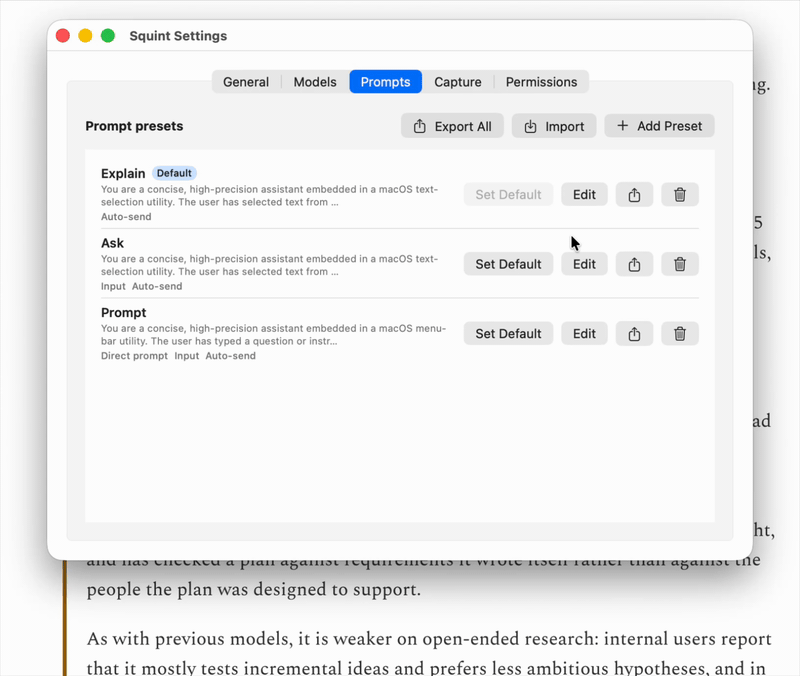

<div align="center">



# Squint

### Select any text. Press <kbd>⌥</kbd> <kbd>Space</kbd>. Get it.

Squint is a tiny, native Mac menu-bar app that puts the LLM of your choice — cloud or local — one keystroke away from any text on your screen.<br>
No copy-paste. No chat tab. No losing your place.


[](LICENSE)

<br>



</div>

## What it does

Squint sends the text you select in any app to an LLM and shows the response in a small panel at your cursor. It can explain the selection, answer a question you ask about it, or take a question with nothing selected.

<table>
  <tr>
    <td width="50%" valign="top">
      
      <p><b>Ask your own question.</b><br>Select a term, press <kbd>⌥</kbd> <kbd>⇧</kbd> <kbd>Space</kbd>, and ask whatever you want to know about it.</p>
    </td>
    <td width="50%" valign="top">
      
      <p><b>Read any language.</b><br>Select a paragraph in any language and get it back in plain English.</p>
    </td>
  </tr>
  <tr>
    <td width="50%" valign="top">
      
      <p><b>Cut through jargon.</b><br>Contracts, papers, specs, filings: the one sentence you're stuck on, in plain words.</p>
    </td>
    <td width="50%" valign="top">
      
      <p><b>Or just ask.</b><br>No selection needed. Press <kbd>⌃</kbd> <kbd>⌥</kbd> <kbd>Space</kbd>, type a question, and keep going with <kbd>⌘</kbd> <kbd>L</kbd> follow-ups.</p>
    </td>
  </tr>
</table>

## How it works

1. **Select** text in almost any app: browser, editor, terminal, PDF, Mail, Slack.
2. **Press** <kbd>⌥</kbd> <kbd>Space</kbd>, or right-click → **Services → Ask Squint**.
3. **Read** the answer as it streams in right at your cursor. <kbd>⌘</kbd> <kbd>C</kbd> copies it, <kbd>⌘</kbd> <kbd>L</kbd> asks a follow-up, and <kbd>Esc</kbd> sends you back to what you were doing.

## Built for people who tune their prompts

Squint works out of the box with three presets, each on its own hotkey:

| Preset | Hotkey | What it does |
| --- | --- | --- |
| **Explain** | <kbd>⌥</kbd> <kbd>Space</kbd> | Explains the selection the moment you press the key |
| **Ask** | <kbd>⌥</kbd> <kbd>⇧</kbd> <kbd>Space</kbd> | Takes the selection plus your own question about it |
| **Prompt** | <kbd>⌃</kbd> <kbd>⌥</kbd> <kbd>Space</kbd> | Skips the selection for a quick, Spotlight-style question |

The real power is in making your own.

- **A hotkey for every prompt.** A preset bundles a system prompt, model, temperature, reasoning effort and panel size, and it can have its own global shortcut. Add <kbd>⌃</kbd> <kbd>⌥</kbd> <kbd>T</kbd> to translate into Spanish, another key to review code, and so on.
- **Mix and match modes.** Two toggles per preset decide whether it reads the selection and whether it waits for your input, so any preset can work like Explain, Ask or Prompt.
- **Any model you want.** Squint works with any OpenAI-compatible API: OpenAI, OpenRouter (Claude, Gemini, Llama and many more), Ollama, LM Studio. Switch models right from the panel, or stay fully offline with a local model.
- **Context-aware prompts.** Presets can use `{{app}}`, `{{windowTitle}}` and `{{date}}`, so one prompt can behave differently in Xcode than in Mail.
- **Follow-ups on demand.** <kbd>⌘</kbd> <kbd>L</kbd> turns an answer into a conversation. The follow-up bar stays hidden until you want it.
- **Instant recall.** Recent answers for each preset are one click away. They reopen exactly as you left them, without calling the model again.
- **Looks like it belongs on your Mac.** The panel is borderless with no title bar, and it opens right at your cursor. It's dark by default, with translucent, light and custom-color themes, and it remembers its size for each preset.

<p align="center">
  
  <br>
  <em>A new preset, from Settings to answer in about fifteen seconds.</em>
</p>

## Private by design

- **No account, no server, no telemetry.** Squint has no backend. Requests go straight from your Mac to the provider you configured, or nowhere at all if you use a local model.
- **Reads only when you ask.** Squint doesn't watch your screen or your clipboard. It reads the selection only when you press the hotkey or use the Services menu.
- **Keys stay in the Keychain.** API keys are stored in your macOS login Keychain, never in plain files.
- **History stays on your Mac.** Squint keeps the last 10 queries per preset locally for quick recall; set the limit to 0 to turn this off. A full history log is opt-in.
- **Clipboard fallback, restored.** Some apps (many browsers, terminals and Electron apps) don't expose the selection to macOS Accessibility. In those, Squint briefly simulates <kbd>⌘</kbd> <kbd>C</kbd> to read it, then puts your clipboard back. You can turn this off in **Settings → Capture**.

## Get started

Squint currently installs from source. You'll need macOS 14 or later, Xcode 15 or later, and [XcodeGen](https://github.com/yonaskolb/XcodeGen).

```bash
brew install xcodegen
git clone https://github.com/ZsoltTanko/squint.git
cd squint
./bin/dev-restart.sh
```

That builds Squint and launches it. It lives in your menu bar (look for the half-closed eye), and it has no Dock icon.

Open **Settings…** from the menu-bar icon, then:

1. **Models → + Add Model.** Point it at your provider: OpenAI, OpenRouter, Ollama, LM Studio or any other OpenAI-compatible endpoint. API keys go straight into the Keychain.
2. **Permissions.** Grant Accessibility access so the hotkey can read your selection. The right-click Services action works without it.
3. **General → Launch at login**, if you want Squint always within reach.

Now select some text anywhere and press <kbd>⌥</kbd> <kbd>Space</kbd>.

## Preset ideas

Here are a few presets worth stealing. Create one in **Settings → Prompts**, paste in the system prompt, and give it a hotkey. The selected text is sent as the message, so the prompt only needs to say what to do with it.

<details>
<summary><b>Translate into another language</b></summary>

```text
Translate the text into natural, idiomatic Spanish. Keep formatting, code and names unchanged. Output only the translation.
```

</details>

<details>
<summary><b>Explain code in context</b></summary>

```text
You are a senior engineer. The user selected this code in {{app}} ({{windowTitle}}). Explain what it does step by step, then point out anything surprising, risky or worth refactoring. Be concise.
```

</details>

<details>
<summary><b>Rewrite it clearer</b></summary>

```text
Rewrite the text to be clearer and more concise while keeping its meaning and tone. Output only the rewritten text, ready to paste.
```

Press <kbd>⌘</kbd> <kbd>C</kbd> in the panel to copy the result.

</details>

<details>
<summary><b>Draft a reply</b> (turn on <i>Requires user input</i>)</summary>

```text
The user selected a message they received in {{app}}. Draft a reply that does the following: {{userInput}}. Match the sender's tone and keep it short. Output only the reply.
```

</details>

<details>
<summary><b>One-line definition</b> (give it a small panel size)</summary>

```text
Define the selected term in one sentence, the way a knowledgeable colleague would. If it's an acronym, expand it first.
```

</details>

Presets can be exported and imported as JSON from **Settings → Prompts**, so a good set is easy to share.

## Reference

### Panel shortcuts

| Key | Action |
| --- | --- |
| <kbd>Esc</kbd> | Close the panel (or collapse the follow-up bar if it's open). Closing also cancels a response that's still streaming. |
| <kbd>⌘</kbd> <kbd>↵</kbd> | Send / Ask |
| <kbd>↵</kbd> | Send, when the preset's input field is focused (<kbd>⇧</kbd> <kbd>↵</kbd> inserts a newline) |
| <kbd>⌘</kbd> <kbd>C</kbd> | Copy the selected part of the response, or all of it if nothing is selected |
| <kbd>⌘</kbd> <kbd>+</kbd> / <kbd>⌘</kbd> <kbd>-</kbd> | Make the response text bigger or smaller (11–18 pt) |
| <kbd>⌘</kbd> <kbd>L</kbd> | Open the follow-up bar |
| <kbd>⌘</kbd> <kbd>,</kbd> | Open Settings (the panel stays open behind it) |

<details>
<summary><b>Presets and modes</b></summary>

Each preset has two toggles in **Settings → Prompts → Edit**, and together they decide how it behaves:

- **Capture selected text on invocation.** When it's on, the selection is sent to the model. When it's off, the panel is a plain prompt box and whatever you type becomes the message.
- **Requires user input.** When it's on, the panel waits for you to type something, which the system prompt can use as `{{userInput}}`.

The three built-in presets cover the common combinations:

- **Explain** (<kbd>⌥</kbd> <kbd>Space</kbd>) sends the selection as soon as you press the hotkey.
- **Ask** (<kbd>⌥</kbd> <kbd>⇧</kbd> <kbd>Space</kbd>) captures the selection and waits for your question.
- **Prompt** (<kbd>⌃</kbd> <kbd>⌥</kbd> <kbd>Space</kbd>) skips the selection and works like a quick chat box.

<kbd>⌥</kbd> <kbd>Space</kbd> opens whichever preset is set as the default, which is Explain to begin with. Change any of these shortcuts in **Settings → General** and **Settings → Prompts**.

All of them can be edited, renamed or deleted. Your edits and deletions are respected across updates. The input field grows with what you type (up to about 30 lines), so multi-paragraph prompts work fine.

</details>

<details>
<summary><b>Window behavior</b></summary>

**Settings → General → Window behavior**

- **Panel placement:** *Centered on cursor* (default), *Near cursor* or *Centered on screen*. The panel always stays on the active screen.
- **When clicking outside the panel:**
  - *Stay on top* (default) keeps it floating until you dismiss it.
  - *Recede to background* lets it behave like a normal window.
  - *Close* dismisses it.

  With the first two, Squint appears in <kbd>⌘</kbd> <kbd>Tab</kbd> while the panel is open, so you can always get back to it. Clicking away never cancels a response; only closing the panel or starting a new query does.

</details>

<details>
<summary><b>History</b></summary>

**Settings → General → History**

- Each preset keeps its recent queries, 10 by default and up to 50; set it to 0 to disable. Open the list with the clock icon in the panel.
- Picking an entry restores that session exactly (the selection or your input, the model and the response) without calling the model again. Press <kbd>⌘</kbd> <kbd>↵</kbd> to get a fresh answer.
- History is stored only on your Mac.

</details>

<details>
<summary><b>Panel size and appearance</b></summary>

- **Size per preset.** Resize the panel by dragging its edge, and the size is saved to the active preset, so a translation preset can open tall while a definition preset stays compact. You can also set it in the preset editor. The built-in presets come sized for their job, and new presets start at 460 × 380.
- **Theme:** *Dark* (default), *System (translucent)*, *Light*, or *Custom colors* (`#RGB`, `#RRGGBB` or `#RRGGBBAA` for background and text). Custom colors pick a matching light or dark style automatically so the rest of the panel stays legible.
- **Font size:** 11–18 pt, 14 by default.

</details>

<details>
<summary><b>Prompt variables</b></summary>

System prompts can include these variables, which are filled in when you invoke a preset:

| Variable | Value |
| --- | --- |
| `{{selection}}` | The selected text (it's also sent as the message) |
| `{{userInput}}` | What you typed into the panel |
| `{{app}}` | The app you were in |
| `{{windowTitle}}` | That app's window title, when macOS provides it |
| `{{date}}` | Today's date |

</details>

## FAQ

**Does it work in every app?**
Almost. The hotkey reads the selection through macOS Accessibility and falls back to a simulated copy in apps that don't support it. Right-click → **Services → Ask Squint** works anywhere macOS Services do. If something doesn't work, see [Troubleshooting](docs/TROUBLESHOOTING.md).

**Which model should I use?**
For the instant feel, use a fast model. With a reasoning model, set the reasoning effort to *minimal* on the model or preset, or answers will take a few seconds to start. Local models through Ollama or LM Studio work too.

**Can I make answers arrive faster?**
If your provider offers a priority tier, yes. Set the model's **Service tier** to `priority` in **Settings → Models**. On OpenAI that's Fast mode, and on OpenRouter it works across the providers that offer one. You get lower latency at a higher per-token price. To use it only for some presets, add the model twice (once with the tier, once without) and pick one per preset.

**One of the hotkeys is already taken on my Mac.**
Change <kbd>⌥</kbd> <kbd>Space</kbd> in **Settings → General**, and any preset's shortcut in **Settings → Prompts**.

## Contributing

Squint is a native Swift app built with SwiftUI and AppKit. It talks to models over plain `URLSession` streaming and depends on just two Swift packages: [KeyboardShortcuts](https://github.com/sindresorhus/KeyboardShortcuts) and [MarkdownUI](https://github.com/gonzalezreal/swift-markdown-ui). The whole dev loop is one command:

```bash
./bin/dev-restart.sh
```

It regenerates the Xcode project if needed, rebuilds, re-registers the Services menu, and relaunches. Before you dig in, read:

1. [Architecture](docs/ARCHITECTURE.md): how the code is laid out and how a request flows through it.
2. [Development](docs/DEVELOPMENT.md): setup, building, testing, debugging and logs.
3. [Extending](docs/EXTENDING.md): recipes for adding a provider, a preset or a capture strategy.
4. [Troubleshooting](docs/TROUBLESHOOTING.md): the macOS gotchas this project has already hit. Read it *before* debugging anything weird.

## License

Squint is released under the [MIT License](LICENSE).
